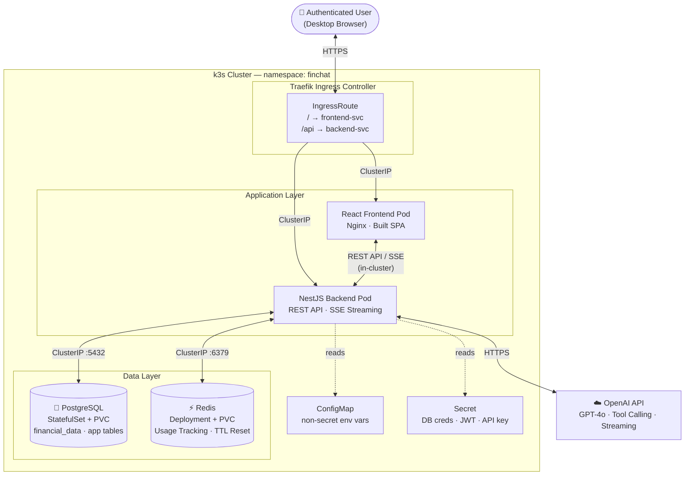
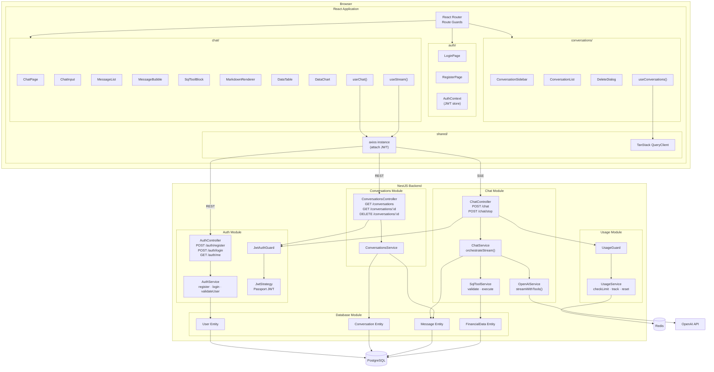
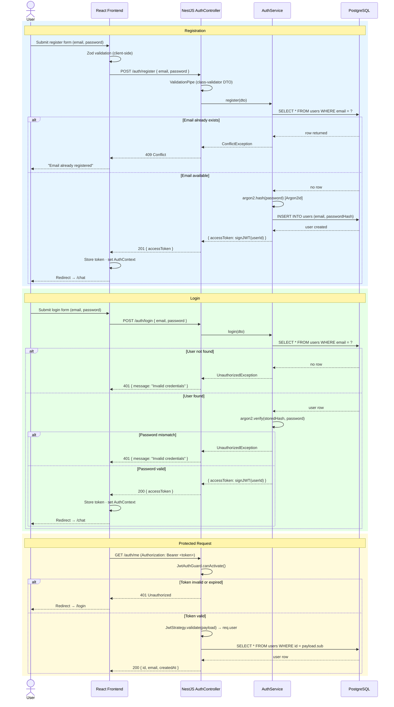
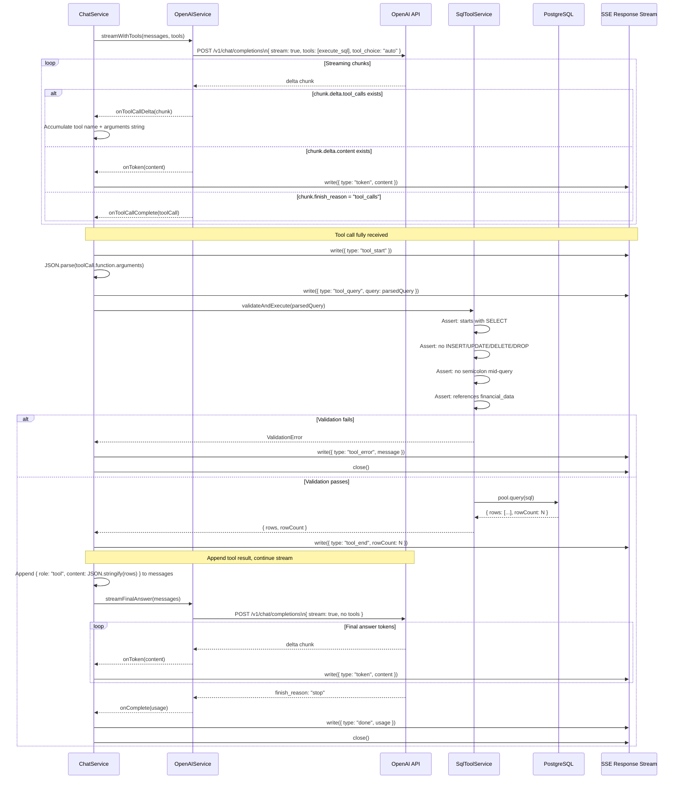
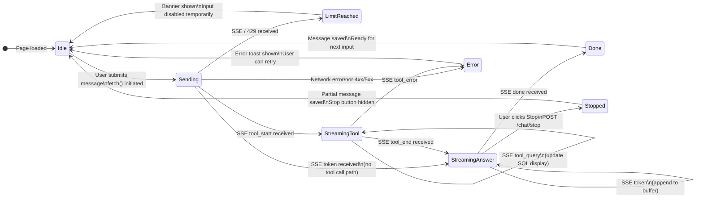
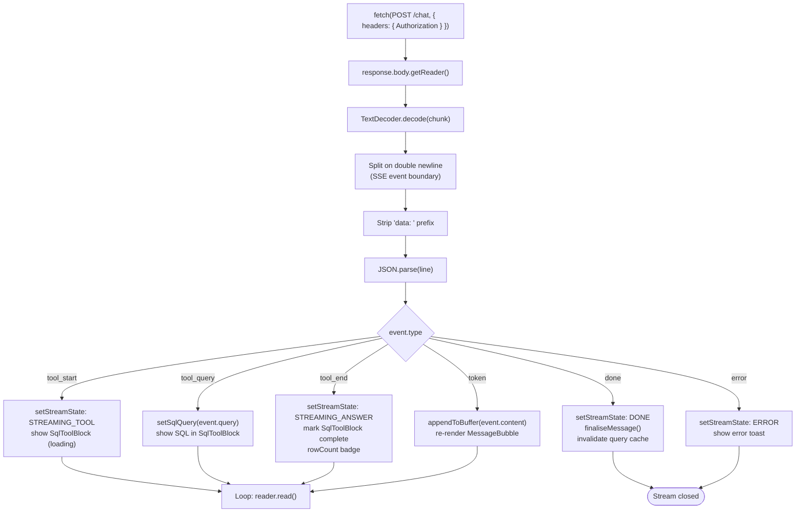
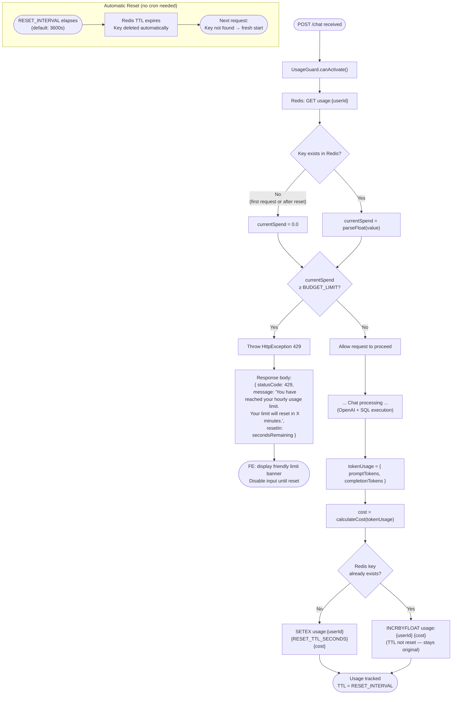
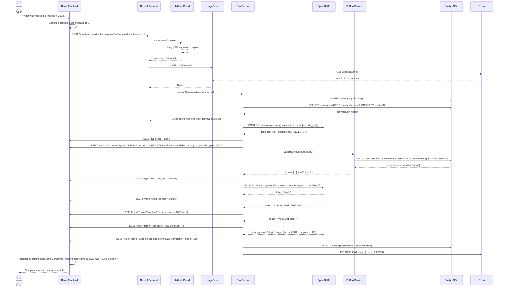

```mermaid
flowchart TD
    A(["User submits message"]) --> B["FE: fetch POST /chat\nwith ReadableStream reader"]
    B --> C{"JwtAuthGuard"}
    C -- "401 Invalid token" --> D(["FE: redirect to /login"])
    C -- "Valid" --> E{"UsageGuard:\nRedis GET usage:userId"}
    E -- "≥ budget limit" --> F["Return 429\nfriendly limit message"]
    F --> G(["FE: show usage limit banner"])
    E -- "Under limit" --> H["Save user message\nto DB (role: user)"]
    H --> I["Load full conversation\nhistory from DB"]
    I --> J["Build OpenAI messages array\n[system, ...history, userMsg]"]
    J --> K["OpenAI stream call\ntools: execute_sql\ntool_choice: auto"]
    K --> L{"OpenAI response\ndelta type?"}

    L -- "tool_call delta" --> M["Accumulate tool call arguments"]
    M --> N["Emit SSE: tool_start"]
    N --> O["Emit SSE: tool_query with SQL"]
    O --> P{"SqlToolService:\nvalidate SQL"}
    P -- "Invalid SQL\n(DML/DDL/injection)" --> Q["Emit SSE: tool_error"]
    Q --> R(["FE: show error in SqlToolBlock"])
    P -- "Valid SELECT" --> S["Execute on PostgreSQL\n(financial_data table)"]
    S --> T{"Rows returned?"}
    T -- "0 rows" --> U["tool result: empty array"]
    T -- "N rows" --> V["tool result: JSON rows"]
    U --> W["Emit SSE: tool_end\nrowCount: 0"]
    V --> W2["Emit SSE: tool_end\nrowCount: N"]
    W --> X["Append tool result\nto messages array"]
    W2 --> X
    X --> Y["Second OpenAI stream call\n(no tools, with tool result)"]

    L -- "content delta" --> AA["Emit SSE: token"]
    Y --> AA

    AA --> AB{"User clicked Stop?"}
    AB -- "Yes" --> AC["AbortController.abort()\npartial = true"]
    AC --> AD["Emit SSE: done\nwith partial flag"]
    AB -- "No" --> AE{"OpenAI stream\nfinished?"}
    AE -- "More tokens" --> AA
    AE -- "Done" --> AD2["Emit SSE: done\nwith token usage"]

    AD --> AF["Save partial assistant\nmessage to DB"]
    AD2 --> AF2["Save full assistant\nmessage to DB"]
    AF --> AG["Redis INCRBYFLOAT\n(partial cost)"]
    AF2 --> AG2["Redis INCRBYFLOAT\n(full cost)"]
    AG --> AH(["FE: render partial message\nStop button disappears"])
    AG2 --> AI(["FE: render complete response\nMarkdown + Table + Chart"])
```

# System Design Document

**Project:** Financial AI Chat Assistant  
**Version:** 1.0  
**Status:** Planning  
**Date:** 2026-07-14

---

## Table of Contents

1. [System Context Diagram](#1-system-context-diagram)
2. [Component Diagram](#2-component-diagram)
3. [Authentication Flow](#3-authentication-flow)
4. [Chat Flow](#4-chat-flow)
5. [SQL Tool Calling Flow](#5-sql-tool-calling-flow)
6. [Streaming Flow](#6-streaming-flow)
7. [Usage Limit Flow](#7-usage-limit-flow)
8. [Full End-to-End Sequence Diagram](#8-full-end-to-end-sequence-diagram)

---

## 1. System Context Diagram

### Diagram



### Explanation

| Actor / System                     | Role                                                                                                      |
| ---------------------------------- | --------------------------------------------------------------------------------------------------------- |
| **Authenticated User**             | Human operating the chat application via a desktop browser                                                |
| **k3s Cluster**                    | Lightweight Kubernetes running all workloads in the `finchat` namespace                                   |
| **Traefik Ingress**                | k3s default ingress controller. Routes `/` → frontend, `/api` → backend. Supports SSE streaming natively. |
| **React Frontend Pod**             | Nginx serving the pre-built React SPA                                                                     |
| **NestJS Backend Pod**             | Orchestrates all business logic: JWT validation, usage limits, OpenAI calls, SQL execution, SSE streaming |
| **OpenAI API**                     | External LLM. Receives conversation history + tool definitions; returns tool calls and answer tokens      |
| **PostgreSQL (StatefulSet + PVC)** | Persistent data store. StatefulSet for stable identity; PVC via k3s local-path provisioner                |
| **Redis (Deployment + PVC)**       | Per-user cumulative spend with TTL-based hourly reset                                                     |
| **ConfigMap**                      | Non-sensitive env vars (model name, limits, URLs) mounted into pods                                       |
| **Secret**                         | Sensitive values: `OPENAI_API_KEY`, `JWT_SECRET`, `DATABASE_URL`, `REDIS_URL` — never committed to git    |

The browser never contacts OpenAI, PostgreSQL, or Redis directly. All access is mediated by the NestJS backend pod via in-cluster DNS (e.g. `postgres-svc.finchat.svc.cluster.local`).

---

## 2. Component Diagram

### Diagram



### Explanation

The component diagram shows three distinct layers:

1. **Browser layer** — Feature-based React components. Each feature folder owns its own API calls, hooks, and components. Shared infrastructure (axios instance with JWT interceptor, TanStack QueryClient) is in `shared/`.

2. **NestJS layer** — Domain modules with thin controllers delegating to services. The critical chain is `ChatController → ChatService → OpenAIService + SqlToolService`. Guards intercept every chat request before it reaches the controller.

3. **Infrastructure layer** — PostgreSQL (persistence), Redis (usage), OpenAI (inference).

---

## 3. Authentication Flow

### Diagram



### Explanation

- **Registration** uses Argon2id (`@node-rs/argon2`) before storing the password. On success, a JWT is returned immediately — the user is logged in after registering.
- **Login** uses the same generic "Invalid credentials" error for both "user not found" and "wrong password" to prevent user enumeration attacks.
- **Protected requests** use Passport's `JwtStrategy` which decodes the token, validates expiry, and attaches `req.user` — consumed by all downstream services.

---

## 4. Chat Flow

### Diagram



### Explanation

The chat flow diagram captures all branches:

- **Authentication failure** — redirect before any processing begins
- **Usage limit** — rejected cleanly with a 429 before hitting OpenAI
- **SQL validation failure** — surfaces as a tool error visible in the UI
- **No rows** — model receives empty result, instructs to say "data not available"
- **Stop generation** — AbortController cancels the OpenAI stream; partial content is always saved
- **Happy path** — tool call executes, model streams final answer, response persisted and rendered

---

## 5. SQL Tool Calling Flow

### Diagram



### Explanation

Two separate OpenAI calls are made per chat turn:

1. **First call** — includes the `execute_sql` tool definition. OpenAI responds with a tool call request instead of an answer. This stream contains the tool call arguments (the SQL query), which are accumulated incrementally.

2. **Second call** — includes the tool result (the SQL rows as JSON). OpenAI generates the final natural-language answer. This stream contains the response tokens.

This two-call pattern is standard OpenAI tool calling behaviour. The SSE stream to the frontend is kept open for both calls, so the user sees a continuous experience: SQL block appears → answer streams in.

---

## 6. Streaming Flow

### State Machine



### SSE Event Format

```
data: {"type":"tool_start"}\n\n
data: {"type":"tool_query","query":"SELECT company, net_income FROM financial_data WHERE company = 'Apple' AND year = 2023"}\n\n
data: {"type":"tool_end","rowCount":1}\n\n
data: {"type":"token","content":"Apple"}\n\n
data: {"type":"token","content":"'s net income"}\n\n
data: {"type":"token","content":" in 2023 was"}\n\n
data: {"type":"token","content":" **$96.99 billion**."}\n\n
data: {"type":"done","usage":{"promptTokens":312,"completionTokens":42}}\n\n
```

### Frontend SSE Consumer



### Explanation

The frontend uses `fetch()` instead of `EventSource` because `EventSource` does not support custom headers — the `Authorization: Bearer <token>` header cannot be set. Using `fetch()` with a `ReadableStream` reader provides equivalent SSE functionality with full control over request headers.

Each token is appended to a `useRef` buffer (not `useState`) to avoid triggering a re-render on every single token. A `requestAnimationFrame` loop or a debounced flush commits the buffer to state ~60fps, producing a smooth animation without overwhelming React's reconciler.

---

## 7. Usage Limit Flow

### Diagram



### Explanation

Key design decisions in the usage limit implementation:

| Decision                              | Rationale                                                                                                                                          |
| ------------------------------------- | -------------------------------------------------------------------------------------------------------------------------------------------------- |
| **Redis TTL for reset**               | No cron job required. Redis natively expires the key after `RESET_INTERVAL` seconds. First write uses `SETEX` to set the value and TTL atomically. |
| **INCRBYFLOAT for increment**         | Atomic operation — safe under concurrent requests from the same user. No race condition between check and increment.                               |
| **TTL not refreshed on increment**    | The reset clock starts at the user's first request, not their last. This prevents users from extending their window by making requests.            |
| **429 with `resetIn`**                | The response includes `resetIn: secondsRemaining` (from `TTL` command) so the frontend can show "resets in 42 minutes" without polling.            |
| **Cost deducted for stopped streams** | Partial OpenAI responses still consume tokens. Fairness and deterrence of abuse require deducting the cost even when stopped.                      |

---

## 8. Full End-to-End Sequence Diagram

### Diagram: Happy Path (S1 — Valid Financial Question)



### Explanation

This diagram traces every hop in the happy-path scenario (S1). Notable points:

1. The optimistic user message is shown in the UI immediately (before the server confirms persistence) to eliminate perceived latency.
2. JWT and Usage guards run synchronously before any database or OpenAI operations begin.
3. The SSE stream is opened **before** the OpenAI call starts, so the frontend can begin rendering the tool execution block as soon as the first tool_call delta arrives.
4. Two OpenAI calls are made in the same SSE session — the connection stays open throughout.
5. Database and Redis writes happen **after** the SSE stream closes, so they do not block the response perceived by the user.
